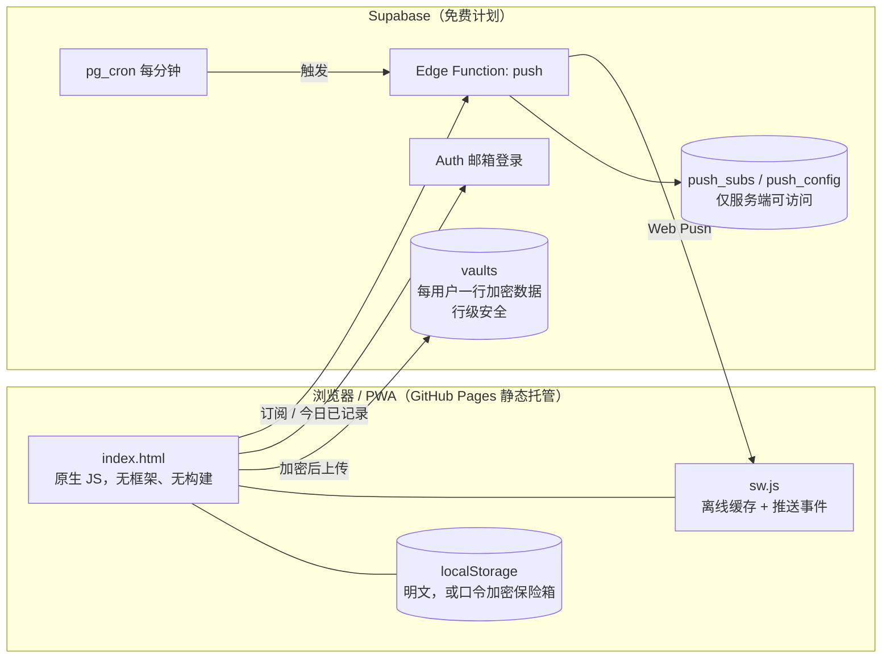

# 晴一日记 · 情绪日记与自我关怀

**在线体验：** <https://cjy20040604-hub.github.io/mood-diary/>

手机浏览器打开即可使用，也可以添加到主屏幕当 App 用。

一句话：花一分钟记下此刻的心情，看清是什么在消耗你，再用冥想、白噪音、运动或想法整理把自己接住。

---

## 1. 为什么做这个

| 用户的处境 | 现有方案的缺口 | 晴一日记怎么做 |
|---|---|---|
| 学业、职场、社交压力下情绪频繁起伏，但没有记录习惯 | 日记类应用要写很多字，记两天就放弃 | 选一个表情就算完成，情绪、触发因素、备注都可以跳过 |
| 知道“最近不太好”，说不出是被什么拖垮 | 只有心情曲线，没有归因 | 触发因素排行、周报，直接指出“哪件事、哪一天、和睡眠的关系” |
| 情绪上来时不知道该做什么，咨询又贵又难约 | 冥想类应用要注册、要付费 | 按当下情绪推荐 1 个冥想、1 种声音、1 个动作，点开就做，免费、无需注册 |
| 担心日记泄露，不敢写真话 | 云端日记要求账号、数据明文存储 | 默认只存在本机；可加口令加密；云同步端到端加密，服务器上只有密文 |

**产品原则**：门槛低、不说教、不制造焦虑、不做操纵式通知、数据归用户。

> 这不是医疗产品，不做诊断。连续低落时只提示求助渠道（全国心理援助热线 12356，紧急情况 120 / 110）。

## 2. 功能总览

### 今日 · 记录
- 5 档心情 + 10 种具体情绪 + 9 类触发因素 + 备注，每天换一条写作提示（“今天最让你消耗的一件事是什么？”）
- 保存后立刻给出一个对应情绪的小练习，闭环到“疗愈”
- 历史记录：按心情筛选、全文搜索、二次确认删除
- **往日今天**：一周前、一个月前、三个月前、一年前的今天你写了什么
- **成就**：首次记录、连续 3 / 7 / 30 天、累计 20 条、完成 5 次练习、整理过想法、情绪觉察 30 次（只统计真实记录，不含示例数据）
- 连续几天心情偏低时，出现温和的提醒和求助渠道

### 洞察 · 看清自己
- **情绪周报**（本地规则生成，不上传任何数据）：和上周对比、最轻松 / 最吃力的一天、情绪构成、拉低心情的触发因素、睡眠关联、周几是低谷、小建议和直达练习的入口；可复制
- **AI 个性化复盘（可选）**：用户填自己的 OpenAI 兼容接口，周报统计和部分备注发给模型，生成 250 字以内的复盘
- 近 14 天情绪曲线、最近 5 周日历热力图、全年像素图
- 触发因素排行、近 30 天情绪构成

### 疗愈 · 接住自己
- **白噪音 / 氛围音**：雨声、海浪、风声、夜晚氛围、白噪音，由浏览器 Web Audio 实时合成，无需联网，可调音量、定时关闭、渐入渐出
- **引导冥想**：4-7-8 呼吸、身体扫描、5-4-3-2-1 着陆、自我慈悲；逐步倒计时，可开关语音朗读和背景音，可跳过
- **动一动**：颈肩放松、原地踏步、桌前拉伸
- **想法整理（认知行为练习）**：情境 → 自动想法 → 难受程度 → 思维陷阱 → 更平衡的想法 → 重新评分，并统计平均降低多少
- 按最近一次的情绪（紧绷 / 低落 / 疲惫 / 平稳）推荐练习

### 设置 · 账号、提醒与数据
- **安装为 App**：PWA，离线可用
- **提醒**（三种可叠加）：应用内提示条；**服务器推送**（关闭网页也能收到，可选“时间窗内随机一次”，今天已记录则不再推送）；写入手机日历的每日重复提醒（.ics）
- **本机加密**：设置口令后，记录、令牌、密钥都以 AES-GCM 加密存储，每次打开需解锁
- **云端账号与同步**：邮箱注册，多设备同步，端到端加密
- 进阶：GitHub 私密 Gist 同步（不想注册账号时使用）
- 导出 / 导入 JSON 备份，清除示例数据，清空全部

## 3. 参考与取舍

调研了 GitHub 上高星的同类开源项目（依据各仓库公开简介，未运行其应用）：

| 项目 | Star | 借鉴 |
|---|---|---|
| Flaque/quirk（认知行为疗法 App） | 2.3k | 想法整理的结构；录入要快、字段可跳过；不做操纵式通知 |
| Demizo/Daily_You（日记） | 1.3k | 随机时间的每日提醒；离线优先；备份与导入导出 |
| journiv（自托管日记） | 1.2k | 提示式日记、搜索、数据分析 |
| GitJournal | 4.2k | 用自己的 Git 账号做存储的同步思路，对应这里的 Gist 同步 |
| Medito（冥想） | 1.3k | 免费、无需注册即可使用 |

主动不做的事：不做社交 / 排行、不做打卡惩罚、不收集用户身份信息、不做连续天数焦虑营销。

## 4. 技术架构

- **前端**：单文件 `index.html`，原生 JavaScript，没有框架和构建步骤，打开即用
- **离线**：`sw.js` 对页面做“网络优先、断网用缓存”，其余资源先读缓存再后台更新
- **加密**：口令经 PBKDF2（25 万次）派生密钥，AES-GCM 加密；本机保险箱和云端同步都用同一套思路
- **云同步**：数据在本机加密成一个文本块，按用户存进 `vaults` 表；多设备按记录 id 合并，删除用“墓碑”记录同步
- **推送**：浏览器订阅 Web Push，订阅信息存进 `push_subs`；`pg_cron` 每分钟调用边缘函数，函数按每个订阅的本地时间判断是否到点，发送后当天不再重复，错过 3 小时以上不补发，失效订阅自动清理
- **AI 复盘**：用户自己的密钥只在内存中，或在启用本机加密后加密保存，不写入页面代码

## 5. 隐私与安全

| 项目 | 做法 |
|---|---|
| 记录存放 | 默认只在本机浏览器；不上传，除非用户主动开启云同步 |
| 本机加密 | 口令加密整个数据集；连续输错 5 次开始限速；忘记口令只能清空本机数据 |
| 云端内容 | 服务器上只有密文，开发者和云服务商都读不到；忘记“云端加密口令”后无法恢复 |
| 数据库权限 | `vaults` 开启行级安全，用户只能读写自己的一行，匿名用户一律拒绝；推送相关两张表收回所有前端权限 |
| 密钥管理 | 推送私钥和定时任务密钥只在数据库配置表里，不在页面、不在本仓库 |
| 令牌与 API Key | 默认只在内存；启用本机加密后才加密落盘 |
| 推送内容 | 通知文案由服务器从固定几句里挑选，不含任何用户记录 |

## 6. 已知限制

- **邮箱确认已关闭**：Supabase 默认发信服务只发给团队成员，所以注册后直接可用。这意味着可以用不存在的邮箱注册。要做真正的邮箱验证和找回密码，需要配置自己的发信服务。
- **PIN / 口令只防“拿到设备的人”这一类风险**，不防已经被入侵的设备。
- **推送依赖浏览器**：iPhone 需要先「添加到主屏幕」；国内部分安卓浏览器没有推送通道。不可用时仍有应用内提示条和日历提醒。
- **AI 复盘需要用户自备接口**，且接口必须允许浏览器跨域访问。
- 推送与云同步的“真实设备端到端”需要使用者授权通知、注册账号后才能完整走通。
- 周报和推荐是规则生成，不是临床判断。

## 7. 测试情况

线上版本上做了约 60 项自动化检查，覆盖：记录、筛选、搜索、删除确认、示例数据、周报、日历、曲线、触发因素排行、成就、往日今天、五种声音的实际播放、冥想与运动引导（含跳过、结束、完成记录）、想法整理、本机加密（启用、锁定、解锁、关闭、磁盘无明文）、导出与导入、提醒设置与日历文件、账号输入校验与真实登录接口的错误提示、Gist 无效令牌提示、模拟云端的加密同步与合并、错误口令不覆盖云端、AI 复盘（模拟接口）、推送服务端的拒绝逻辑。另检查了手机宽度和深色模式下无横向溢出。

测试中发现并修复 2 个问题：示例数据被算进“连续天数”成就；缓存策略会让已安装用户在发布后看到旧页面。

**没有自动验证的**：真实邮箱注册与登录、真实设备收到推送通知、AI 复盘接真实模型。这三项需要账号授权、通知授权或模型密钥，需要人工走一遍。

## 8. 仓库文件

| 文件 | 说明 |
|---|---|
| `index.html` | 整个应用 |
| `sw.js` | Service Worker：离线、推送、通知点击 |
| `manifest.webmanifest`、`icon-192.png`、`icon-512.png` | PWA 安装信息与图标 |
| `supabase-schema.sql` | 数据库表与行级安全（不含任何密钥） |
| `supabase-push-function.ts` | 推送边缘函数源码（不含任何密钥） |

## 9. 后续方向

- 配置自有发信服务，恢复邮箱确认与找回密码
- 为推送加用户级频控与管理后台
- 英文界面与更多冥想内容（可录制真人音频）
- 周报接入更细的睡眠 / 运动数据
